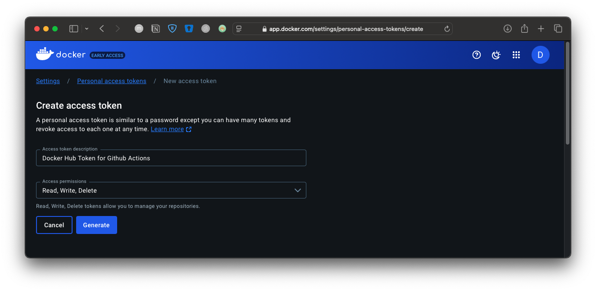
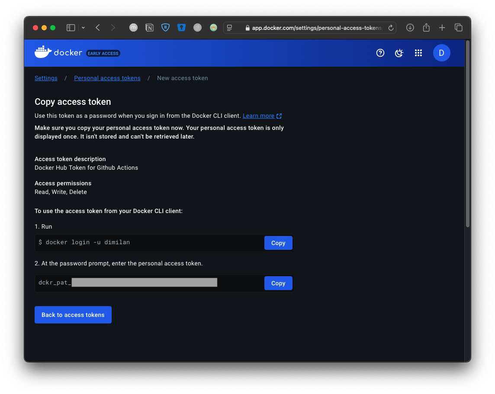
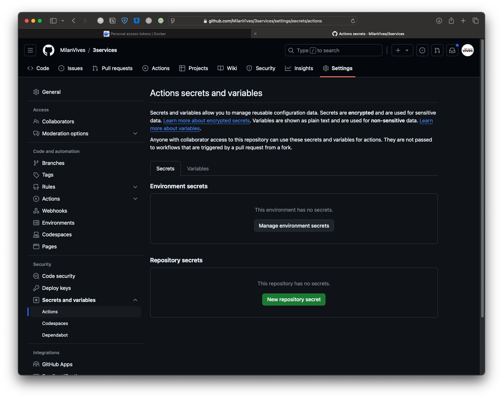
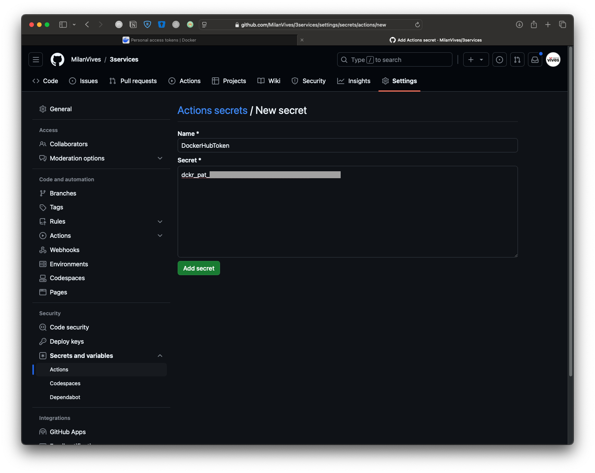
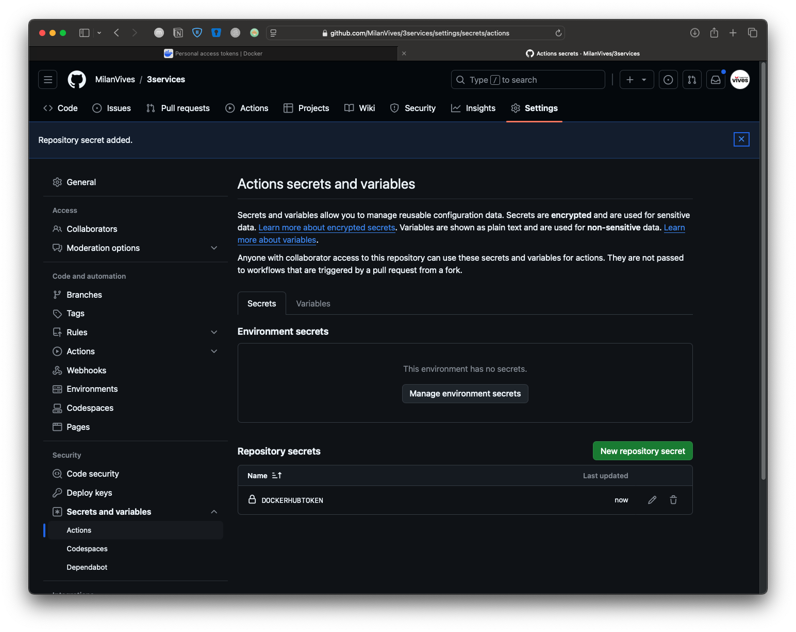

## Readme.md

This repository consists of a Node.js API connected to a MongoDB database and a HTML + Javascript Frontend fetching the data from the backend. 

The main branch contains the Fron- and the backend
The dockerized branch contains the two Dockerfiles and the docker-compose.yaml file
The ci-cd branch contains the GitHub Actions yaml file to automatically build the docker images on push to the repository

### Github Actions

Create Dockerhub token via: 

Account Settings >> Personal Access tokens on hub.docker.com

Create Docker Hub Token (https://app.docker.com/settings/personal-access-tokens/create)




Add DH Token to GA via Repository Settings on Github
Secrets and Variables > Repository Secrets > New Repository secret





### Project Directory structure
```
.
|-- Readme.md
|-- backend
|   |-- Dockerfile
|   |-- node_modules
|   |-- package-lock.json
|   |-- package.json
|   `-- server.js
|-- compose.yml
|-- frontend
|   |-- Dockerfile
|   `-- index.html
```